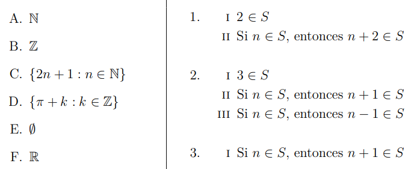

# Ejercicio 1

## Consigna

Considere el conjunto $\mathbb{R}$ de los números reales; la lista de subconjuntos de $\mathbb{R}$ de la columna izquierda; y los conjuntos de reglas de la columna derecha.

1. Indique cuales subconjuntos satisfacen cuales conjuntos de reglas.

2. Para cada conjunto de reglas, indicar que conjunto definen.

## Resolución (parte 1)

### Conjunto A: $\mathbb{N}$

Conjunto de reglas 1:
1. $2\in S$: Cumple con este punto porque $2\in \mathbb{N}$
2. Si $n \in S$, entonces $n+2 \in S$: Cumple con este punto, porque la suma entre naturales es cerrada; es decir que si a cualquier natural le sumo 2 en particular, voy a obtener otro natural

Conjunto de reglas 2:
1. $3\in S$: Cumple con este punto porque $3\in \mathbb{N}$
2. Si $n\in S$, entonces $n+1\in S$: Cumple con este punto por el mismo razonamiento anterior.
3. Si $n\in S$, entonces $n-1\in S$: No cumple: $n=0$ es un contraejemplo

Conjunto de reglas 3:

Se ignorará de aquí en adelante porque tiene una regla sola que ya probamos en el conjunto 3.

### Conjunto B: $\mathbb{Z}$

Conjunto de reglas 1:
1. $2\in S$: Cumple con este punto porque $2\in \mathbb{Z}$
2. Si $n \in S$, entonces $n+2 \in S$: Cumple con este punto, porque la suma entre enteros es cerrada; es decir que si a cualquier entero le sumo 2 en particular, voy a obtener otro entero

Conjunto de reglas 2:
1. $3\in S$: Cumple con este punto porque $3\in \mathbb{Z}$
2. Si $n\in S$, entonces $n+1\in S$: Cumple con este punto por el mismo razonamiento anterior.
3. Si $n\in S$, entonces $n-1\in S$: Cumple con este punto por el mismo razonamiento anterior, $-1$ es un entero, entonces la suma con otro entero será un entero.

### Conjunto C: $\{2n+1: n\in\mathbb{N}\}$

Conjunto de reglas 1:
1. $2\in S$: No cumple con este punto, porque el conjunto $C$ es el conjunto de los impares, y $2$ es par
2. Si $n \in S$, entonces $n+2 \in S$: Cumple con este punto, porque la suma entre un par e impar, siempre me da un impar, en particular, 2 es par; mientras que $n \in C$ tiene que ser de la forma $2k+1$ para algún $k\in N$, es decir: impar

Conjunto de reglas 2:
1. $3\in S$: Cumple con este punto porque $3$ es impar
2. Si $n\in S$, entonces $n+1\in S$: No cumple con este punto; pues $3\in C$ pero $4\not\in C$
3. Si $n\in S$, entonces $n-1\in S$: No cumple con este punto; pues $3\in C$ pero $2\not\in C$

### Conjunto D: $\{\pi + k: k\in\mathbb{Z}\}$

Conjunto de reglas 1:
1. $2\in S$: No cumple con este punto, porque al sumar o restar un entero a $\pi$, no puedo obtener 2
2. Si $n \in S$, entonces $n+2 \in S$: Cumple con este punto, porque si $n\in D$ entonces $n = \pi + k$ para algún $k\in \mathbb{Z}$; sumando 2 a este número, puedo llamar $k'= k + 2$, obteniendo entonces que $n+2 = \pi + k'$. Como $k'$ es entero por construcción, entonces podemos decir que $n+2 \in D$

Conjunto de reglas 2:
1. $3\in S$: No cumple con este punto por el mismo razonamiento anterior (regla 1)
2. Si $n\in S$, entonces $n+1\in S$: Cumple con este punto por el mismo razonamiento anterior (regla 2)
3. Si $n\in S$, entonces $n-1\in S$: Cumple con este punto por el mismo razonamiento anterior (regla 2)

**Observación**: Varios de estos razonamientos son verdaderos porque la suma de enteros es cerrada, y para obtener el siguiente elemento (o anterior) sumamos (o restamos) una cantidad entera

## Resolución (parte 2)

**Conjunto de reglas 1**

El conjunto construido por estas reglas es:

$$A: \{2n: n\in \mathbb{N} - \{0\}\}$$

**Conjunto de reglas 2**

El conjunto construido por estas reglas es: $\mathbb{Z}$

**Conjunto de reglas 3**

Este conjunto de reglas no construye ningún conjunto de forma inductiva, porque no tenemos elementos base.