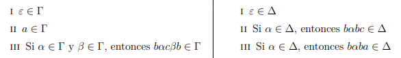

# Ejercicio 6

## Consigna

Considere el alfabeto $\sum = \{a,b,c\}$, y los lenguajes $\Gamma$ y $\Delta$ definidos inductivamente con las siguientes reglas:

(a) Encuentre palabras de $\sum^*$ que no pertenezcan a $\Gamma$. Análogo para $\Delta$.

(b) Muestre que $\Gamma$ no está incluído en $\Delta$ y que $\Delta$ tampoco está incluído en $\Gamma$.

Para probar que un lenguaje no está incluído en otro debe proporcionar una palabra que pertenezca al primer lenguaje y no pertenezca al segundo, con las justificaciones que correspondan.

## Resolución

(a) Veamos 3 palabras que no pertenecen a cada lenguaje:

- **Palabras $w \notin \Gamma$**:
    - $bbc$
    - $ababccb$
    - $abcb$

- **Palabras $w \notin \Delta$**:
    - $a$
    - $babc$
    - $baba$

(b) Veamos que $\Gamma$ no está incluido en $\Delta$ utilizando la sugerencia dada:

La palabra $w=bbc$ no pertenece a $\Gamma$, ya que facilmente se observa que todas las palabras a excepción de los elementos base terminan en $b$; pero $w$ si pertenece a $\Delta$, podemos definirla usando la segunda regla con $\alpha = \varepsilon$

Ahora veamos que $\Delta$ no está incluido en $\Gamma$:

La palabra $w=bcb$ no pertenece a $\Delta$, ya que facilmente se observa a partir de las reglas que ninguna palabra del conjunto termina en $b$; pero $w$ si pertenece a $\Gamma$, podemos definirla usando la tercer regla con $\alpha = \beta = \varepsilon$

Esto demuestra que:

$$\Gamma\nsubseteq\Delta\text{ y }\Delta \nsubseteq\Gamma$$