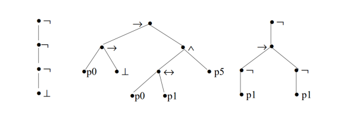
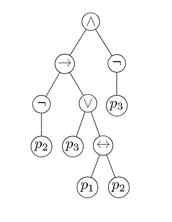

# Ejercicio 2

## Consigna

(a) Dibuje los árboles de las proposiciones del Ejercicio 1.

(b) Determine a qué proposiciones corresponden los árboles de la Figura 1.

    

**Figura 1:** Árboles de proposiciones del Ejercicio 2.

### Resolución (parte a)

#### Proposición 1

Queremos representar la siguiente proposición

$$(((\neg p_2) \to (p_3 \lor (p_1 \leftrightarrow p_2))) \land (\neg p_3)) \in PROP$$

    

#### Proposición 2

