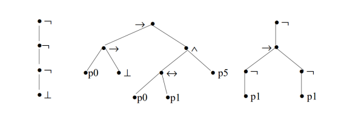
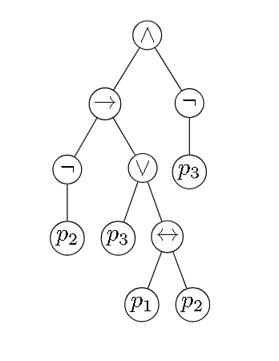
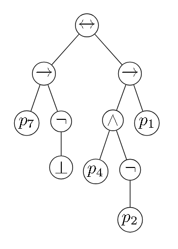

# Ejercicio 2

## Consigna

(a) Dibuje los árboles de las proposiciones del Ejercicio 1.

(b) Determine a qué proposiciones corresponden los árboles de la Figura 1.

    

**Figura 1:** Árboles de proposiciones del Ejercicio 2.

### Resolución (parte a)

#### Proposición 1

Queremos representar la siguiente proposición

$$(((\neg p_2) \to (p_3 \lor (p_1 \leftrightarrow p_2))) \land (\neg p_3)) \in PROP$$

    

#### Proposición 2

Queremos representar la siguiente proposición:

$$((p_7 \to (\neg\bot)) \leftrightarrow ((p_4 \land (\neg p_2)) \to p_1)) \in PROP$$

    

### Resolución (parte b)

#### Proposición 1

La Figura 1 corresponde a la proposición:

$$\neg(\neg(\neg\bot))$$

#### Proposición 2

La Figura 2 corresponde a la proposición:

$$(p_0\rightarrow\bot)\rightarrow((p_0\leftrightarrow p_1)\land(p_5))$$

#### Proposición 3

La Figura 3 corresponde a la proposición:

$$\neg(\neg p_1\rightarrow \neg p_1)$$

Observar que en este caso se saltean paréntesis, la forma completa (obviando los paréntesis de toda la proposición) sería:

$$\neg((\neg p_1)\rightarrow(\neg p_1))$$