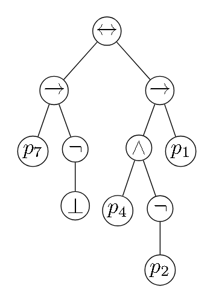

# Ejercicio 8

## Consigna

(a) Defina una función de rango $r : PROP \to \mathbb{N}$ que dada una fórmula proposicional calcula la altura del árbol asociado a esa fórmula. Ejemplo: $r(p_i) = 0$.

Calcule el rango de las proposiciones del Ejercicio 1.

(b) Defina una función $con : PROP \to \mathbb{N}$ tal que $con(\varphi)$ denota la cantidad de ocurrencias de conectivos en la fórmula $\varphi$.

Calcule $con$ para las proposiciones del Ejercicio 1.

(c) Indique cuál de las siguientes afirmaciones es correcta y cuál no, y en cada caso justifique su respuesta mediante la demostración:

1. Para toda fórmula $\varphi$, $r(\varphi) \geq con(\varphi)$.

2. Para toda fórmula $\varphi$, $r(\varphi) < con(\varphi)$.

3. Para toda fórmula $\varphi$, $r(\varphi) \leq con(\varphi)$.

## Premisa

Estaremos definiendo funciones usando el ERP sobre $PROP$, veamos como se define dicho esquema:

Sea $B$ un conjunto, y:

1. una función $H_{AT}: AT\rightarrow B$, y
2. para cada conectivo $*\in C_2$, una función $H_*: PROP\times B\times PROP\times B\rightarrow B$, y
3. una función $H_{\neg}: PROP\times B\rightarrow B$

Entonces, existe una única función $F: PROP\rightarrow B$ tal que:

1. $F(\alpha) = H_{AT}(\alpha)$ con $\alpha\in AT$
2. $F((\alpha * \beta)) = H_*(\alpha, F(\alpha), \beta, F(\beta))$ con $\alpha,\beta\in PROP$
3. $F((\neg\alpha)) = H_{\neg}(\alpha, F(\alpha))$ con $\alpha\in PROP$

## Resolución (parte a)

**Observación:** Se define la altura de un árbol por la máxima cantidad de aristas que se deben recorrer para llegar a una hoja. 

Definamos la función $r: PROP\rightarrow \mathbb{N}$ que dado una fórmula proposicional, calcula la altura del árbol asociado a esa fórmula. Para esto definamos las funciones auxiliares $H_{AT}$, $H_*$ y $H_{\neg}$:

1. $H_{AT}(\alpha) = 0$ con $\alpha\in AT$
2. $H_*(\alpha, h_1, \beta, h_2) = 1 + \max(h_1, h_2)$ con $\alpha, \beta\in PROP$
3. $H_{\neg}(\alpha, h) = 1 + h$ con $\alpha\in PROP$

Entonces, definimos $r: PROP\rightarrow \mathbb{N}$ como:

1. $r(\alpha) = 0$ con $\alpha\in AT$
2. $r((\alpha * \beta)) = 1 + \max(r(\alpha), r(\beta))$ con $\alpha, \beta\in PROP$
3. $r((\neg\alpha)) = 1 + r(\alpha)$ con $\alpha\in PROP$

Calculemos $r$ para las proposiciones del Ejercicio 1:

### Proposición 1

$$(((\neg p_2) \to (p_3 \lor (p_1 \leftrightarrow p_2))) \land (\neg p_3)) \in PROP$$

Calculemos su altura:

$$r((((\neg p_2) \to (p_3 \lor (p_1 \leftrightarrow p_2))) \land (\neg p_3))) = 4$$

### Proposición 2

$$((p_7 \to (\neg\bot)) \leftrightarrow ((p_4 \land (\neg p_2)) \to p_1)) \in PROP$$

Calculemos su altura:

$$r(((p_7 \to (\neg\bot)) \leftrightarrow ((p_4 \land (\neg p_2)) \to p_1))) = 4$$

## Resolucion (parte b)

Definamos la función $con: PROP\rightarrow \mathbb{N}$ tal que $con(\varphi)$ denota la cantidad de ocurrencias de conectivos en la fórmula $\varphi$. Para esto definamos las funciones auxiliares $H_{AT}$, $H_*$ y $H_{\neg}$:

1. $H_{AT}(\alpha) = 0$ con $\alpha\in AT$
2. $H_*(\alpha, c_1, \beta, c_2) = 1 + c_1 + c_2$ con $\alpha, \beta\in PROP$
3. $H_{\neg}(\alpha, c) = 1 + c$ con $\alpha\in PROP$

Entonces, definimos $con: PROP\rightarrow \mathbb{N}$ como:

1. $con(\alpha) = 0$ con $\alpha\in AT$
2. $con((\alpha * \beta)) = 1 + con(\alpha) + con(\beta)$ con $\alpha, \beta\in PROP$
3. $con((\neg\alpha)) = 1 + con(\alpha)$ con $\alpha\in PROP$

Calculemos $con$ para las proposiciones del Ejercicio 1:

### Proposición 1

$$(((\neg p_2) \to (p_3 \lor (p_1 \leftrightarrow p_2))) \land (\neg p_3)) \in PROP$$

Calculemos la cantidad de conectivos:

$$con((((\neg p_2) \to (p_3 \lor (p_1 \leftrightarrow p_2))) \land (\neg p_3))) = 6$$

### Proposición 2

$$((p_7 \to (\neg\bot)) \leftrightarrow ((p_4 \land (\neg p_2)) \to p_1)) \in PROP$$

Calculemos la cantidad de conectivos:

$$con(((p_7 \to (\neg\bot)) \leftrightarrow ((p_4 \land (\neg p_2)) \to p_1))) = 6$$

Observar que $\bot$ no es considerado un conectivo.

## Resolucion (parte c)

### Afirmación 1

Para toda fórmula $\varphi$, $r(\varphi) \geq con(\varphi)$.

Esta afirmación es FALSA, tenemos como contraejemplo cualquiera de las proposiciones del Ejercicio 1.

### Afirmación 2

Para toda fórmula $\varphi$, $r(\varphi) < con(\varphi)$.

Esta afirmación es FALSA, veamos el siguiente contraejemplo:

$$\varphi = \neg(\neg(\neg p_1))$$

Observemos que: $r(\varphi) = 3$ y $con(\varphi) = 3$

### Afirmación 3

Para toda fórmula $\varphi$, $r(\varphi) \leq con(\varphi)$.

Esta afirmación es VERDADERA, veamos la demostración usando el PIP sobre $PROP$

#### PASO BASE

$P(\alpha): r(\alpha) \leq con(\alpha)$ con $\alpha\in AT$

Usando las respectivas reglas 1 de $r$ y $con$ tenemos que:

1. $r(\alpha) = 0$ con $\alpha\in AT$
2. $con(\alpha) = 0$ con $\alpha\in AT$

Entonces, $r(\alpha) \leq con(\alpha)$

#### PASO INDUCTIVO

(H) $P(\varphi): r(\varphi) \leq con(\varphi)$ con $\varphi\in PROP$

##### PARTE 1

(T) $P((\neg\varphi)): r((\neg\varphi)) \leq con((\neg\varphi))$ con $\varphi\in PROP$

Usando las respectivas reglas 3 de $r$ y $con$ tenemos que:

1. $r((\neg\varphi)) = 1 + r(\varphi)$ con $\varphi\in PROP$
2. $con((\neg\varphi)) = 1 + con(\varphi)$ con $\varphi\in PROP$

Entonces veamos la siguiente cadena de sii:

$$
r((\neg\varphi)) \leq con((\neg\varphi))\iff\\
1 + r(\varphi) \leq 1 + con(\varphi)\iff\\
r(\varphi) \leq con(\varphi)
$$

Donde lo último se cumple por la hipótesis

##### PARTE 2

(T) $P((\varphi * \psi)): r((\varphi * \psi)) \leq con((\varphi * \psi))$ con $\varphi, \psi\in PROP$

Usando las respectivas reglas 2 de $r$ y $con$ tenemos que:

1. $r((\varphi * \psi)) = 1 + \max(r(\varphi), r(\psi))$ con $\varphi, \psi\in PROP$
2. $con((\varphi * \psi)) = 1 + con(\varphi) + con(\psi)$ con $\varphi, \psi\in PROP$

Entonces veamos la siguiente cadena de sii:

$$
r((\varphi * \psi)) \leq con((\varphi * \psi))\iff\\
1 + \max(r(\varphi), r(\psi)) \leq 1 + con(\varphi) + con(\psi)\iff\\
\max(r(\varphi), r(\psi)) \leq con(\varphi) + con(\psi)
$$

Pero sabemos por hipótesis que:

1. $r(\varphi) \leq con(\varphi)$
2. $r(\psi) \leq con(\psi)$

Por consecuencia, $\max(r(\varphi), r(\psi)) \leq con(\varphi) + con(\psi)$

Entonces, $r((\varphi * \psi)) \leq con((\varphi * \psi))$

Esto prueba la propiedad para todo $\varphi$