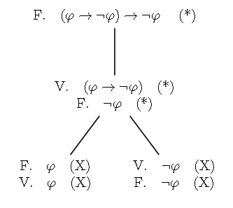

# Ejercicio 3

## Consigna

Considere $\varphi, \psi, \sigma$ pertenecientes a $PROP$. Demuestre que:

(a) $\models (\varphi \to \psi) \leftrightarrow (\neg \psi \to \neg \varphi)$ (contraposición)

(b) $\models (\varphi \to \psi) \land (\psi \to \sigma) \to (\varphi \to \sigma)$ (transitividad de $\to$)

(c) $\models (((\varphi \to \psi) \to \varphi) \to \varphi)$ (Ley de Pierce)

(d) $\models (\varphi \to (\psi \land \neg \psi)) \to \neg \varphi$

(e) $\models (\varphi \to \neg \varphi) \to \neg \varphi$

(f) $\models \neg (\varphi \land \neg \varphi)$

(g) $\models \varphi \to (\psi \to \varphi \land \psi)$

## Resolución

Enfrentaremos este problema usando el concepto de tableau semántico.

### Parte (a)

$$\models (\varphi \to \psi) \leftrightarrow (\neg \psi \to \neg \varphi)$$

Queremos verificar que la proposición es tautología. Apliquemos el concepto de Tableau semántico.

Como encontramos una contradicción en todas las ramas, podemos confirmar que la proposición dada es una tautología.

### Parte (b)

$$\models (\varphi \to \psi) \leftrightarrow (\neg \psi \to \neg \varphi)$$

Queremos verificar que la proposición es tautología. Apliquemos el concepto de Tableau semántico.

Como encontramos una contradicción en todas las ramas, podemos confirmar que la proposición dada es una tautología.

### Parte (c)

$$\models (((\varphi \to \psi) \to \varphi) \to \varphi)$$

Queremos verificar que la proposición es tautología. Apliquemos el concepto de Tableau semántico.

Como encontramos una contradicción en todas las ramas, podemos confirmar que la proposición dada es una tautología.

### Parte (d)

$$\models (\varphi \to (\psi \land \neg \psi)) \to \neg \varphi$$

Queremos verificar que la proposición es tautología. Apliquemos el concepto de Tableau semántico.

Como encontramos una contradicción en todas las ramas, podemos confirmar que la proposición dada es una tautología.

**Observación:** La contradicción en la rama derecha es un poco más rebuscada pero claramente es una contradicción.

### Parte (e)

$$\models (\varphi \to \neg \varphi) \to \neg \varphi$$

Queremos verificar que la proposición es tautología. Apliquemos el concepto de Tableau semántico.

Como encontramos una contradicción en todas las ramas, podemos confirmar que la proposición dada es una tautología.

### Parte (f)

$$\models \neg (\varphi \land \neg \varphi)$$

Queremos verificar que la proposición es tautología. Apliquemos el concepto de Tableau semántico.

Como encontramos una contradicción en todas las ramas, podemos confirmar que la proposición dada es una tautología.

### Parte (g)

$$\models \varphi \to (\psi \to \varphi \land \psi)$$

Queremos verificar que la proposición es tautología. Apliquemos el concepto de Tableau semántico.

Por lo que vemos esto no sería una tautología, porque no encontramos una contradicción del lado izquierdo. aunque es raro porque la letra indica que todas las proposiciones del ejercicio lo son. 