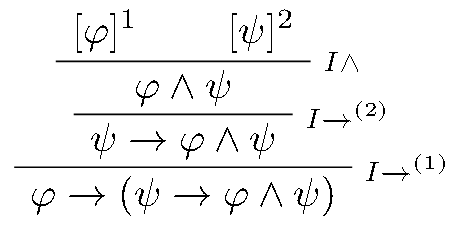
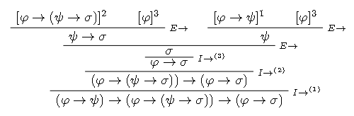

# Ejercicio 1

## Consigna

Sean $\varphi, \psi, \sigma$ proposiciones cualesquiera de $PROP$. Construya derivaciones que demuestren que las siguientes proposiciones son teoremas del cálculo proposicional:

(a) $\varphi \rightarrow \varphi$  
(b) $\bot \rightarrow \varphi$  
(c) $\neg(\varphi \land \neg \varphi)$  
(d) $\varphi \rightarrow (\psi \rightarrow \varphi \land \psi)$  
(e) $(\varphi \rightarrow \psi) \leftrightarrow \neg (\varphi \land \neg \psi)$  
(f) $(\varphi \land \psi) \leftrightarrow \neg (\varphi \rightarrow \neg \psi)$  
(g) $(\varphi \rightarrow (\psi \rightarrow \sigma)) \leftrightarrow (\psi \rightarrow (\varphi \rightarrow \sigma))$  
(h) $(\varphi \rightarrow \psi) \land (\varphi \rightarrow \neg \psi) \rightarrow \neg \varphi$  
(i) $(\varphi \rightarrow \psi) \rightarrow ((\varphi \rightarrow (\psi \rightarrow \sigma)) \rightarrow (\varphi \rightarrow \sigma))$  
(j) $((\varphi \rightarrow \psi) \rightarrow (\varphi \rightarrow \sigma)) \rightarrow (\varphi \rightarrow (\psi \rightarrow \sigma))$  
(k) $((\varphi \rightarrow \psi) \rightarrow \varphi) \rightarrow \varphi$

## Resolución

### Parte (a)

Queremos probar $\vdash\varphi\to\varphi$, veamos la prueba:

{ width=50% }

### Parte (b)

Queremos probar $\vdash\bot\rightarrow \varphi$, veamos la prueba:

{ width=50% }

### Parte (c)

Queremos probar $\vdash\neg(\varphi \land \neg \varphi)$, veamos la prueba:

{ width=50% }

### Parte (d)

Queremos probar $\vdash\varphi \rightarrow (\psi \rightarrow \varphi \land \psi)$, veamos la prueba:

{ width=50% }

### Parte (e)

Queremos probar $\vdash(\varphi \rightarrow \psi) \leftrightarrow \neg (\varphi \land \neg \psi)$, veamos la prueba:

### Parte (f)

Queremos probar $\vdash(\varphi \land \psi) \leftrightarrow \neg (\varphi \rightarrow \neg \psi)$, veamos la prueba:

### Parte (g)

Queremos probar $\vdash(\varphi \rightarrow (\psi \rightarrow \sigma)) \leftrightarrow (\psi \rightarrow (\varphi \rightarrow \sigma))$, veamos la prueba:

### Parte (h)

Queremos probar $\vdash(\varphi \rightarrow \psi) \land (\varphi \rightarrow \neg \psi) \rightarrow \neg \varphi$, veamos la prueba:

### Parte (i)

Queremos probar $\vdash(\varphi \rightarrow \psi) \rightarrow ((\varphi \rightarrow (\psi \rightarrow \sigma)) \rightarrow (\varphi \rightarrow \sigma))$, veamos la prueba:

### Parte (j)

Queremos probar $\vdash((\varphi \rightarrow \psi) \rightarrow (\varphi \rightarrow \sigma)) \rightarrow (\varphi \rightarrow (\psi \rightarrow \sigma))$, veamos la prueba:

### Parte (k)

Queremos probar $\vdash((\varphi \rightarrow \psi) \rightarrow \varphi) \rightarrow \varphi$, veamos la prueba:

