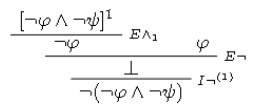
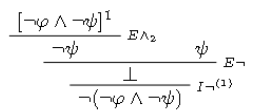
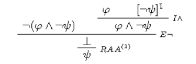
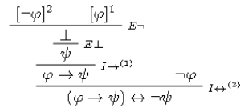
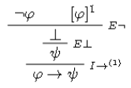
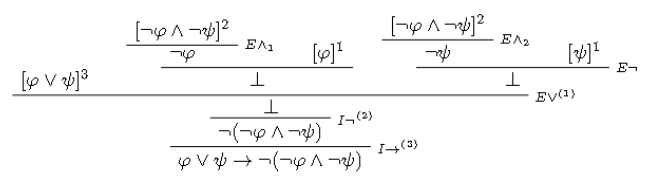

# Ejercicio 3

## Consigna

Sean $\varphi, \psi, \sigma$ proposiciones cualesquiera de $PROP$. Demuestre que:

(a) $\varphi \vdash \neg (\neg \varphi \land \neg \psi)$  
(b) $\psi \vdash \neg (\neg \varphi \land \neg \psi)$  
(c) $\neg (\varphi \land \neg \psi), \varphi \vdash \psi$  
(d) $\neg \varphi \vdash (\varphi \rightarrow \psi) \leftrightarrow \neg \varphi$  
(e) $\neg \varphi \vdash \varphi \rightarrow \psi$  
(f) $\vdash \varphi \lor \psi \rightarrow \neg (\neg \varphi \land \neg \psi)$  
(g) Si $\vdash \varphi$ entonces $\vdash \psi \lor \varphi$  
(h) Si $\vdash \varphi$ entonces $\vdash \psi \rightarrow \varphi$

## Resolución

### Demostración (a)

Queremos demostrar que $\varphi \vdash \neg (\neg \varphi \land \neg \psi)$. Veamos como hacerlo:

Como observación para los siguientes casos, veamos que $\varphi$ queda "sin justificar" solo porque es una hipótesis, este será el caso para todas las hipótesis que tengamos a la hora de demostrar consecuencias semánticas.

### Demostración (b)

Queremos demostrar que $\psi \vdash \neg (\neg \varphi \land \neg \psi)$. Veamos como hacerlo:

### Demostración (c)

Queremos demostrar que $\neg (\varphi \land \neg \psi), \varphi \vdash \psi$. Veamos como hacerlo:

### Demostración (d)

Queremos demostrar que $\neg \varphi \vdash (\varphi \rightarrow \psi) \leftrightarrow \neg \varphi$. Veamos como hacerlo:

### Demostración (e)

Queremos demostrar que $\neg \varphi \vdash \varphi \rightarrow \psi$. Veamos como hacerlo:

### Demostración (f)

Queremos demostrar que $\vdash \varphi \lor \psi \rightarrow \neg (\neg \varphi \land \neg \psi)$. Veamos como hacerlo:

### Demostración (g)

Queremos demostrar que Si: $\vdash \varphi$ entonces $\vdash \psi \lor \varphi$. Para esta parte, la prueba es diferente. Veamos como se demuestra:

(H) $\vdash \varphi$
(T) $\vdash \varphi\lor\psi$

$$
\begin{aligned}
&\vdash\varphi\\
&\iff\scriptstyle(\text{definición de }\vdash)\\
&(\exists D_1\in DER)\mid C(D_1)=\varphi; H(D_1) = \emptyset\\
&\Rightarrow\scriptstyle(\text{por regla }I\lor\text{ de la definición de }DER)\\
&(\exists D_2\in DER)\mid C(D_2)=\varphi\lor\psi; H(D_2) = \emptyset\\
&\iff\scriptstyle(\text{definición de }\vdash)\\
&\vdash\varphi\lor\psi
\end{aligned}
$$

La idea de estos casos es probarlo considerando el lenguaje $DER$ y sus reglas

### Demostración (g)

Queremos demostrar que: Si $\vdash \varphi$ entonces $\vdash \psi \to \varphi$. Para esta parte, la prueba es diferente. Veamos como se demuestra:

(H) $\vdash \varphi$
(T) $\vdash \varphi\to\psi$

$$
\begin{aligned}
&\vdash\varphi\\
&\iff\scriptstyle(\text{definición de }\vdash)\\
&(\exists D_1\in DER)\mid C(D_1)=\varphi; H(D_1) = \emptyset\\
&\Rightarrow\scriptstyle(\text{por regla }I\to\text{ de la definición de }DER)\\
&(\exists D_2\in DER)\mid C(D_2)=\varphi\to\psi; H(D_2) = \{\varphi\}\\
&\iff\scriptstyle(\text{definición de }\vdash)\\
&\vdash\varphi\to\psi
\end{aligned}
$$

