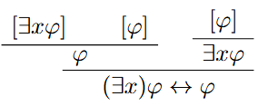
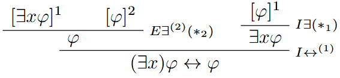

# Ejercicio 1

## Consigna

Dada la siguiente derivación para $\vdash \exists x\ \varphi \leftrightarrow \varphi$, donde $x \not\in FV(\varphi)$:

Indicar:
- Las **reglas aplicadas en cada paso**
- A qué aplicación de regla corresponde cada **cancelación de hipótesis**

## Resolución

Donde:

1. $(*_1)I\exists$ es correcto porque $x\notin FV(\varphi)$ que son las hipótesis abiertas para este momento.
2. $(*_2)E\exists$ es correcto porque $x\notin FV(\varphi)$ (conclusión) y también tenemos que $x\notin FV(\exists x \varphi)$ (hipótesis abiertas).

