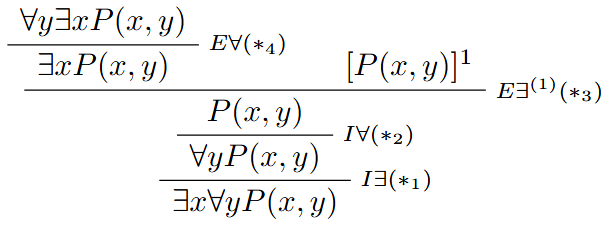
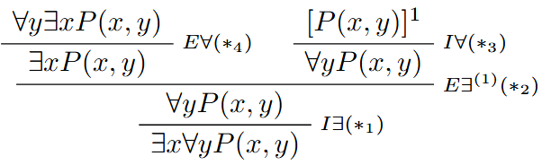

# Ejercicio 2

## Consigna

Indique porque las siguientes derivaciones no son correctas

1. Primera derivación:

2. Segunda derivación:

## Resolución

### Parte 1

Veamos todos los pasos para determinar los correctos y los que no lo son:

1. $(*_1)$ es correcto, pues $x$ está libre para $x$ en $\forall y P(x,y)$
2. $(*_2)$ es INCORRECTO, pues $y$ ocurre libre en la fórmula $P(x,y)\in H(D)$
3. $(*_3)$ es INCORRECTO pues $x$ está libre para $C(D):= P(x,y)$
4. $(*_4)$ es correcto pues $y$ está libre para $y$ en $C(D):=\exists x P(x,y)$

### Parte 2

Veamos todos los pasos para determinar los correctos y los que no lo son:

1. $(*_1)$ es correcto pues $x$ está libre para $x$ en $\forall y\exists x P(x,y)$
2. $(*_2)$ es INCORRECTO pues $x$ ocurre libre en $C(D):=\forall y P(x,y)$. De todos modos $x$ no ocurre libre en las hipótesis sin cancelar en este momento: $x\notin FV(\forall y\exists x P(x,y))$
3. $(*_3)$ es correcto pues $y$ está libre para las hipótesis abiertas pues no hay hipótesis abiertas en este momento.
4. $(*_4)$ es correcto pues $y$ está libre para $y$ en $\exists P(x,y)$