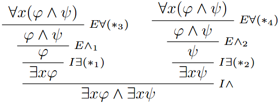

# Ejercicio 3

## Consigna

Sean $\varphi$, $\psi$ fórmulas de $\text{FORM}$. Construya derivaciones que demuestren:

1. $\forall x(\varphi \rightarrow \psi) \vdash (\forall x\ \varphi \rightarrow \forall x\ \psi)$  
2. $\forall x\ \varphi \vdash \neg \forall x(\neg \varphi)$  
3. $\forall x\ \varphi \vdash \forall z\ \varphi[z/x]$ (donde $z$ no ocurre en $\varphi$)  
4. $\forall x \forall y\ \varphi \vdash \forall y \forall x\ \varphi$  
5. $\forall x \forall y\ \varphi \vdash \forall x\ \varphi[x/y]$, con $x \not\in BV(\varphi)$  
6. $\forall x(\varphi \land \psi) \vdash \exists x\ \varphi \land \exists x\ \psi$  
7. $\exists x\ \varphi,\ \forall x(\varphi \rightarrow \psi) \vdash \exists x\ \psi$

## Resolución

### Parte 2

Donde:

1. $(*_1)$ es correcto pues $x$ está libre para $x$ en $\neg\varphi$
2. $(*_2)$ es correcto pues $x$ está libre para $x$ en $\varphi$

### Parte 3

Donde:

1. $(*_1)$ es correcto pues $z\notin FV(\forall x\varphi)$ que es la hipótesis abierta en este momento.
2. $(*_2)$ es correcto pues $z$ está libre para $x$ en $\varphi$ (pues por hipótesis $z$ no ocurre en $\varphi$)

### Parte 5

Donde:

1. $(*_1)$ es correcto pues $x\notin FV(\forall x\forall y\varphi)$ que es la hipótesis abierta en este momento.
2. $(*_2)$ es correcto pues $x$ está libre para $y$ en $\varphi$ por la hipótesis de que $x\notin BV(\varphi)$ que significa que no aparece $(\forall x)$ en $\varphi$
3. $(*_3)$ es correcto pues $x$ está libre para $x$ en $\forall y\varphi$

### Parte 6

Donde:

1. $(*_1)$ es correcto pues $x$ está libre para $x$ en $\varphi$
2. $(*_2)$ es correcto pues $x$ está libre para $x$ en $\psi$
3. $(*_3)$ es correcto pues $x$ está libre para $x$ en $(\varphi\land\psi)$
4. $(*_4)$ es correcto pues $x$ está libre para $x$ en $(\varphi\land\psi)$
