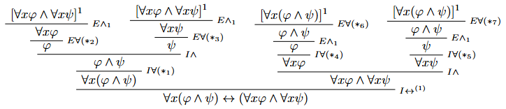
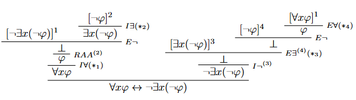

# Ejercicio 4

## Consigna

Demuestre los siguientes teoremas del cálculo de predicados:

1. $\vdash \exists x\ \varphi \leftrightarrow \varphi$ (con $x \not\in FV(\varphi)$)  
2. $\vdash \forall x(\varphi \land \psi) \leftrightarrow (\forall x\ \varphi \land \forall x\ \psi)$  
3. $\vdash \forall x(\varphi \rightarrow \psi) \leftrightarrow (\varphi \rightarrow \forall x\ \psi)$, con $x \not\in FV(\varphi)$  
4. $\vdash \exists x(\varphi \land \psi) \leftrightarrow (\exists x\ \varphi \land \psi)$, con $x \not\in FV(\psi)$  
5. $\vdash \forall x\ \varphi \leftrightarrow \neg \exists x(\neg \varphi)$  
6. $\vdash \neg \exists x\ \varphi \leftrightarrow \forall x(\neg \varphi)$

## Resolución

### Parte 2

Donde:

1. $(*_1)$ es correcto pues $x\notin FV(\forall x\varphi\land\forall x\psi)$ que es la única hipótesis abierta en este momento.
2. $(*_2)$ es correcto pues $x$ está libre para $x$ en $\varphi$
3. $(*_3)$ es correcto pues $x$ está libre para $x$ en $\psi$
4. $(*_4)$ es correcto pues $x\notin FV(\forall x\varphi\land\forall x\psi)$ que es la única hipótesis abierta en este momento.
5. $(*_5)$ es correcto pues $x\notin FV(\forall x\varphi\land\forall x\psi)$ que es la única hipótesis abierta en este momento.
6. $(*_6)$ es correcto pues $x$ está libre para $x$ en $(\varphi\land\psi)$
7. $(*_7)$ es correcto pues $x$ está libre para $x$ en $(\varphi\land\psi)$

### Parte 5

Donde:

1. $(*_1)$ es correcto pues $x\notin FV(\neg\exists x(\neg\varphi))$ que es la única hipótesis abierta en este punto.
2. $(*_2)$ es correcto pues $x$ está libre para $x$ en $\neg\varphi$
3. $(*_3)$ es correcto pues $x\notin C(D):=FV(\bot)$ y también $x\notin FV(\forall x\varphi)$ que es la única hipótesis abierta en este punto.
4. $(*_4)$ es correcto pues $x$ está libre para $x$ en $\varphi$