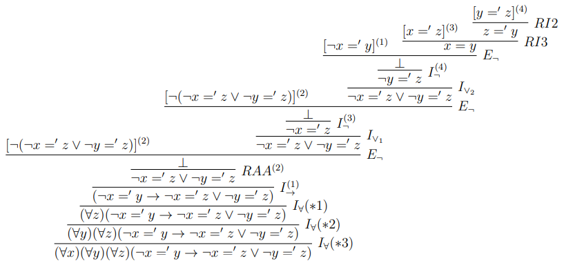

# Ejercicio 7

## Consigna

Demuestre:

1. $(\forall x)(\forall y)\ x =' y \vdash (\forall y)(\forall x)\ y =' x$  
2. $\vdash (\forall z)(z =' x \leftrightarrow z =' y) \rightarrow x =' y$  
3. $\vdash (\forall x)(\exists y)\ x =' y$  
4. $\vdash (\forall x)(\forall y)(\forall z)(\neg x =' y \rightarrow \neg x =' z \lor \neg y =' z)$  
5. Para toda $\varphi \in \text{FORM}$, si $y \not\in V(\varphi)$:  
   $\vdash (\forall x)(\varphi \leftrightarrow (\forall y)(x =' y \rightarrow \varphi[y/x]))$

6. Para toda $\varphi \in \text{FORM}$, si $y \not\in V(\varphi)$:  
   $\vdash (\forall x)(\varphi \leftrightarrow (\exists y)(x =' y \land \varphi[y/x]))$

## Resolución

### Parte 1

Donde:

1. $(*_1)$ es correcto pues $y\notin FV((\forall x)(\forall y)x='y)$
2. $(*_2)$ es correcto pues $x\notin FV((\forall x)(\forall y)x='y)$
3. $(*_3)$ es correcto pues $y$ está libre para $y$ en $x='y$
4. $(*_4)$ es correcto pues $x$ está libre para $x$ en $(\forall y)x='y$

### Parte 2

Donde:

1. $(*_1)$ es correcto pues $x$ está libre para $z$ en $(z='x\leftrightarrow z='y)$

### Parte 4

Donde:

1. $(*_1)$ es correcto pues $z\notin FV(\emptyset)$ pues todas las hipótesis fueron canceladas antes.
2. $(*_2)$ es correcto pues $y\notin FV(\emptyset)$ pues todas las hipótesis fueron canceladas antes.
3. $(*_3)$ es correcto pues $x\notin FV(\emptyset)$ pues todas las hipótesis fueron canceladas antes.

### Parte 5

1. $(*_1)$ es correcto pues $x$ está libre para $y$ en $(x =' y \rightarrow \varphi[y/x])$, esto porque por hipótesis tenemos que $y\notin V(\varphi)$
2. $(*_2)$ es correcto pues $y$ está libre para $x$ en $\varphi$ porque $y\notin V(\varphi)$ y también $x$ está libre para $x$ en $\varphi$
3. $(*_3)$ es correcto pues $y\notin FV(\varphi)\subseteq V(\varphi)$
3. $(*_4)$ es correcto pues $x\notin FV(\emptyset)$