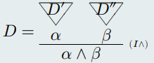
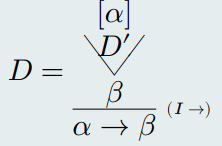

# CLASE 10 - 27/04/2025

## Corrección del cálculo proposicional

La corrección de un cálculo, nos indica que las reglas de construcción de sus juicios reflejan nociones semánticas. Un cálculo es correcto para una semántica.

### Teorema de corrección

Sean $\Gamma\subseteq PROP$ y $\alpha\in PROP$:
- Si $\Gamma\vdash\alpha$, entonces $\Gamma\models\alpha$

#### Observaciones

1. Por la definición de derivación, tenemos que:
    - $\Gamma\vdash\alpha\iff(\exists D\in DER)((\Gamma=\Gamma'\cup H(D))$ y $C(D)=\alpha)$
2. Si se prueba que:
    - $(\forall D\in DER)H(D)\models C(D)$

    Entonces se puede probar la tesis $(\Gamma\models\alpha)$.
3. Esto último se puede hacer mediante inducción en DER.

Veamos como probarlo usando inducción, considerando la siguiente propiedad sobre $D\in DER$:
- $H(D)\models C(D)$

##### CASO BASE

$\varphi\models\varphi$: $D = \varphi$, por lo que coinciden hipótesis y tesis.

**Demostración:** Es trivial, pues en todas las valuaciones $v$ tal que $v(\varphi)=1$, se cumple que $v(\varphi)=1$.

##### PASO INDUCTIVO

En este paso deberíamos probar la propiedad para todas las reglas del conjunto $DER$, no lo vamos a hacer por una cuestión de tiempo. Veamos algunos ejemplos:

**CASO $I\land$**

En este caso $D$ se construye a partir de la regla $I\land$.

*(HI)*

1. Sea $D'$ tal que $H(D')\models C(D')$ con $C(D')=\alpha$
2. Sea $D''$ tal que $H(D'')\models C(D'')$ con $C(D'')=\beta$
3. $D$ tiene la siguiente forma:
    

*(TI)*: $H(D)\models\alpha\land\beta$

**Demostración:**

1. Por definición de $H(D)$ se sabe que $H(D) = H(D')\cup H(D'')$ por lo que se cumple que dada una valuación cualquiera:

$$
(\forall\varphi\in H(D): v(\varphi)=1)\Rightarrow\begin{cases}
(\forall\varphi\in H(D'): v(\varphi)=1) \\
(\forall\varphi\in H(D''): v(\varphi)=1) \\
\end{cases}
$$

2. Por HI1 y HI2, para toda valuación $v$ se cumple que:

$$
\begin{cases}
(\forall\varphi\in H(D'): v(\varphi)=1)\Rightarrow v(\alpha) = 1\\
(\forall\varphi\in H(D''): v(\varphi)=1)\Rightarrow v(\beta) = 1
\end{cases}
$$

3. Juntando los puntos 1 y 2, se cumple que:

$$
(\forall\varphi\in H(D): v(\varphi)=1)\Rightarrow\begin{cases}
v(\alpha)=1 \\
v(\beta)=1 
\end{cases}
$$

4. Por lo que por definición de valuación y de consecuencia lógica, se cumple la tesis.

**CASO $I\to$**

En este caso $D$ se construye a partir de la regla $I\to$.

*(HI)*

1. Sea $D'$ tal que $H(D')\models C(D')$ con $C(D')=\beta$
2. $D$ tiene la siguiente forma:
    

*(TI)*: $H(D)\models\alpha\to\beta$

**Demostración:**

1. Por HI1 se sabe que para cualquier valuación $v$ se cumple que:

$$
(\forall\varphi\in H(D'): v(\varphi)=1)\Rightarrow v(\beta)=1
$$

2. Por definición de $H(D)$, se sabe que en este caso, como mucho $H(D') = H(D)\cup\{\alpha\}$ (podría ser que $H(D) = H(D')$).

3. Por la anterior afirmación, se sabe que dada cualquier valuación $v$, se cumple que:

$$
(\forall\varphi\in H(D): v(\varphi)=1)\Rightarrow(\forall\varphi\in H(D'):v(\varphi)=1\text{ o bien }v(\alpha)=0)
$$

4. Por la afirmación anterior, dada una valuación $v$ tal que: $(\forall\varphi\in H(D): v(\varphi)=1)$, ésta tiene que cumplir una de las dos condiciones del consecuente, por lo tanto:
    - o bien la valuación hace verdaderas a todas las fórmulas de $H(D')$, con lo que $v(\beta)=1$ por hipótesis.
    - o bien $v(\alpha)=0$

    En cualquiera de estos dos casos, $v(\alpha\to\beta)=1$, por lo que se cumple la tesis.

#### Usos del teorema de corrección

El teorema de corrección proporciona formas de mostrar una consecuencia semántica, en particular, otra forma de mostrar que una fórmula es una tautología.
- Si $\vdash\alpha$, entonces $\models\alpha$

Proporciona formas de mostrar cuando no se cumple una consecuencia sintáctica. En particular una forma de mostrar que una fórmula no es teorema.
- Si $\not\models\alpha$, entonces $\not\vdash\alpha$

## Completitud del cálculo proposicional

### Teorema de completitud

Sean $\Gamma\subseteq PROP$ y $\alpha\in PROP$.
- Si $\Gamma\models\alpha$ entonces $\Gamma\vdash\alpha$

#### Observaciones

1. Dice que dada una consecuencia semántica, podemos hacer una derivación que la justifique.
2. Es el recíproco de corrección.
3. Demostraremos el contrarrecíproco.

**Demostración:**

$$
\begin{aligned}
&\Gamma\not\vdash\alpha\\
&\Rightarrow\scriptstyle{(\text{contrarecíproco RAA})}\\
&\Gamma,\neg\alpha\not\vdash\bot\\
&\Rightarrow\scriptstyle{(\text{?})}\\
&(\exists v)(\forall\varphi\in\Gamma\cup\{\neg\alpha\})(v(\varphi)=1)\\
&\Rightarrow\scriptstyle{(\text{definición de valuación})}\\
&(\exists v)(\forall\varphi\in\Gamma)(v(\varphi)=1\text{ y }v(\alpha)=0)\\
&\Rightarrow\scriptstyle{(\text{definición de consecuencia semántica})}\\
&\Gamma\not\models\alpha
\end{aligned}
$$

Esto probaría lo que queremos, pero que hicimos en el paso con la justificación incógnita? Necesitamos algunos elementos más para poder entender que estamos haciendo en este paso. Esto nos introduce a lo siguiente:

- Nuevas definiciones:
    - Conjuntos consistentes de fórmulas.
    - Conjuntos consistentes maximales de fórmulas.
    - Teorías.
- Nuevos resultados:
    - Condición suficiente de consistencia: si un conjunto es satisfacible, entonces es consistente.
    - Todo conjunto consistente está incluido en algún conjunto consistente maximal.

### Definición (conjunto consistente)

Un conjunto $\Gamma\subseteq PROP$ es consistente (o libre de contradicciones) sii $\Gamma\not\vdash\bot$.

De esto derivamos la definición de un conjunto inconsistente:

Decimos que un conjunto $\Gamma\subseteq PROP$ es inconsistente si $\Gamma\vdash\bot$

#### Lema

Las siguientes afirmaciones son equivalentes:

1. $\Gamma$ es inconsistente.
2. Para toda $\varphi\in PROP$ se cumple que $\Gamma\vdash\varphi$.
3. Existe $\varphi\in PROP$ tal que $\Gamma\vdash\varphi$ y $\Gamma\vdash\neg\varphi$.

Por lo tanto sus contrarrecíprocos también son equivalentes:

1. $\Gamma$ es consistente.
2. Existe $\varphi\in PROP$ que cumple que $\Gamma\not\vdash\varphi$.
3. Para todo $\varphi\in PROP$ se cumple que $\Gamma\not\vdash\varphi$ o $\Gamma\not\vdash\neg\varphi$.

Más allá de las definiciones, las ideas son bien intuitivas.

Para probar esto, bastaría con decir que $1\to2\land 2\to3\land3\to1$, por simpleza probaremos solo el siguiente caso:

**$1\to2$**

*(H)* $\Gamma$ es inconsistente
*(T)* Para toda $\varphi\in PROP$ se cumple $\Gamma\vdash\varphi$

**Demostración:**

$$
\begin{aligned}
&\Gamma\vdash\bot\\
&\Rightarrow\scriptstyle{(\text{notación }\vdash)}\\
&(\exists D\in DER)H(D)\subseteq\Gamma\text{ y }C(D)=\bot\\
&\Rightarrow\scriptstyle{(\text{eliminación de }\bot)}\\
&(\forall\varphi)(\exists D\in DER)H(D)\subseteq\Gamma\text{ y }C(D)=\varphi\\
&\Rightarrow\scriptstyle{(\text{notación }\vdash)}\\
&\Gamma\vdash\varphi
\end{aligned}
$$

Faltarían probar las demás equivalencias.

### Condición suficiente de consistencia

*(H)* Dado $\Gamma\subseteq PROP$ tal que hay al menos una valuación $v$ que cumple que:
- $(\forall\varphi\in\Gamma)v(\varphi)=1$

*(T)* $\Gamma$ es consistente.

Para la demostración probaremos el contrarrecíproco, es decir:

*(H)* $\Gamma$ es inconsistente, es decir $\Gamma\vdash\bot$

*(T)* No existe ninguna valuación tal que:
- $(\forall\varphi\in\Gamma)v(\varphi)=1$

**Demostración**

$$
\begin{aligned}
&\Gamma\vdash\bot\\
&\Rightarrow\scriptstyle{(\text{teorema de corrección})}\\
&\Gamma\vdash\bot\\
&\Rightarrow\scriptstyle{(\text{notación de }\models)}\\
&(\forall w)\text{ Si }(\forall\varphi\in\Gamma)w(\varphi)=1,\text{ entonces }\\
&\Rightarrow\scriptstyle{(\text{RAA: }v(\bot)\neq 1\quad\forall v)}\\
&\text{No hay ninguna valuación tal que }(\forall\varphi\in\Gamma)w(\varphi)=1
\end{aligned}
$$

#### Propiedades de conjuntos consistentes

1. Si $\Gamma\cup\{\neg\varphi\}$ es inconsistente, entonces $\Gamma\vdash\varphi$.
2. Si $\Gamma\cup\{\varphi\}$ es inconsistenten entonces $\Gamma\vdash\neg\varphi$

Otra forma de verlo:

1. Si $\Gamma\not\vdash\varphi$, entonces $\Gamma\cup\{\neg\varphi\}$ es consistente.
2. Si $\Gamma\not\vdash\neg\varphi$, entonces $\Gamma\cup\{\varphi\}$ es consistente.

### Definición (consistencia maximal)

Un conjunto $\Gamma\subseteq PROP$ es consistente maximal sii:

1. $\Gamma$ es consistente
2. Si $\Delta\subseteq PROP$ es consistente y $\Gamma\subseteq\Delta$, entonces $\Gamma=\Delta$

#### Corolario 1 (otra versión de la definición)

1. $\Gamma$ es consistente
2. Si $\Delta\subseteq PROP$ cumple $\Gamma\subset\Delta$, entonces $\Delta$ es inconsistente.

#### Corolario 2 (otra versión de la definición)

1. $\Gamma$ es consistente
2. Para cualquier $\varphi\in PROP$ se cumple que si $\varphi\notin\Gamma$ entonces $\Gamma\cup\{\varphi\}$ es inconsistente

### Definición (teoría)

Un conjunto $\Gamma\subseteq PROP$ es una teoría sii $CONS(\Gamma)\subseteq\Gamma$, es decir si $\Gamma$ contiene a todas sus derivaciones.

#### Otra versión

Un conjunto $\Gamma\subseteq PROP$ es una teoría sii para toda $\varphi\in PROP$, si $\Gamma\vdash\alpha$ entonces $\alpha\in\Gamma$

#### Lema

Veamos que si $\Gamma$ es un conjunto consistente maximal, entonces $\Gamma$ también es una teoría.

*(H)* Sea $\Gamma$ consistente maximal.

*(T)* $\Gamma$ es teoría.

**Demostración:**

$$
\begin{aligned}
&\Gamma\vdash\alpha\\
&\Rightarrow\scriptstyle{(\Gamma\text{ es consistente})}\\
&\Gamma\not\vdash\neg\alpha\\
&\Rightarrow\scriptstyle{(\text{propiedad de conjunto consistente})}\\
&\Gamma\cup\{\alpha\}\text{ es consistente}\\
&\Rightarrow\scriptstyle{(\Gamma\text{ es consistente MAXIMAL})}\\
&\alpha\in\Gamma
\end{aligned}
$$