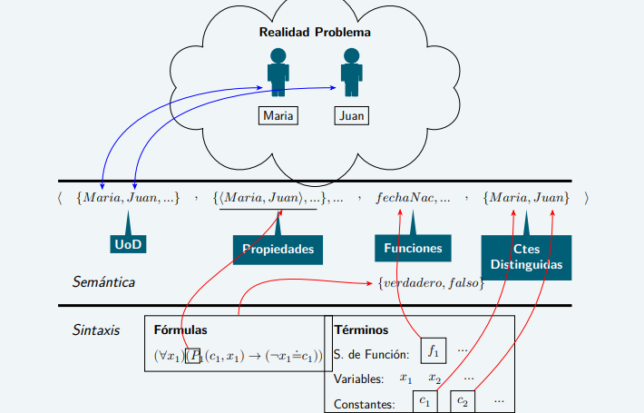

# CLASE 12 - 06/05/2025

## Introducción a la lógica de predicados

La anterior imagen modela un poco lo que buscamos hacer a la hora de introducir este nuevo lenguaje. Veremos con un ejemplo posterior que ya no es suficiente la Lógica Proposicional para describir detalladamente determinadas facetas de la realidad. Veamos algunas observaciones sobre el diagrama:

- **UoD** significa "Universo de Discurso", que es donde básicamente se contienen todos los elementos.
- **Propiedades** es un conjunto de subconjuntos que contienen elementos que cumplen una propiedad, o bien relaciones entre elementos que cumplen una propiedad (por ejemplo en la imagen: la propiedad es "Ser madre de").
- Por último, la fórmula del ejemplo dice que, para todo elemento $x_1$ del universo, si María es madre de ese elemento, entonces $x_1$ no es María.

### Ejemplo de Formalización en $PROP$

Veamos la siguiente situación:

- Llamamos $p$ a la siguiente proposición: *"Todo natural es entero"*
- Decimos que *"Si 2 es un natural, entonces 2 es un entero"*. Llamando:
    - *"2 es un natural"* como $q$, y
    - *"2 es un entero"* como $r$

- Esto tiene mucho sentido, pero a la hora de analizar su significado con las herramientas que aprendimos, vemos que:

$$
p\not\models q\to r
$$

Necesitamos algo un poco más formal para trabajar con estas cuestiones.

### Lenguaje de la lógica de predicados

En este lenguaje tenemos:

- Símbolos para denotar objetos:
    - Símbolos de constantes: permiten referirse a objetos determinados del universo:
        - Mafalda, 2, $\pi$
    - Símbolos de variables: permiten referirse a objetos genéricos del universo:
        - $x,n,\alpha$
    - Símbolos de función: permiten referirse a operaciones (unarias, binarias, etc.):
        - $m+1,2!,(1+1)!$
- Símbolos para denotar propiedades y relaciones.
    - Los llamamos símbolos de predicado, por ejemplo:
        - $Par$ es un símbolo de propiedad (unario)
        - $\geq$ es un símbolo de relación binario
    - Estos símbolos se usan para representar afirmaciones simples:
        - $Par(2)$
        - $x\geq 1$
- Conectivos.
    - Permiten combinar afirmaciones.
    - Igual que en lógica proposicional, éstos son: $\bot,\land,\lor,\neg,\neg,\to,\leftrightarrow$
    - Ejemplos:
        - $Par(2)\land x\geq 1$
        - $x\geq 1\to\neg\bot$
- Cuantificadores.
    - Cuantifican los objetos genéricos (variables)
        - Cuantificador universal $\forall$
        - Cuantificador existencial $\exists$
    - Ejemplos:
        - $(\forall n)((Par(n)\land 1\geq n)\to n=0)$
        - $(\forall x)(\exists y)x\geq y$
