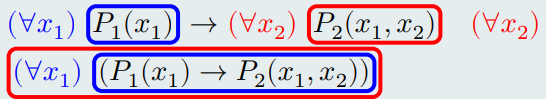
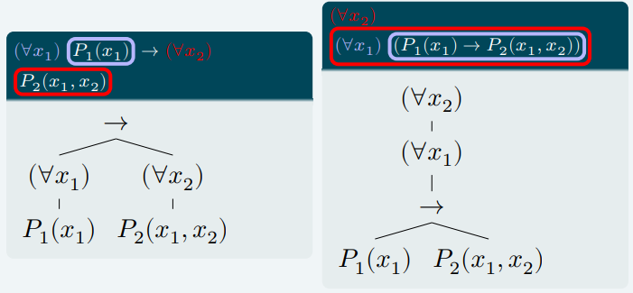

# CLASE 13 - 07/05/2025

## Sintáxis de la lógica de predicados

### Definición (estructura)

Una estructura es una secuencia ordenada:

$$
\mathcal{M} = \left<U,R_1,\ldots,R_n,F_1,\ldots,F_m,\{C_i\mid 1\leq i\leq k\} \right>
$$

Tal que:

- $U$ es un conjunto no vacío (notación: $U=|\mathcal{M}|$)
- $R_1,\ldots,R_n$ son relaciones sobre $U (n\geq 0)$
- $F_1,\ldots,F_m$ son funciones en $U (m\geq 0)$
- $\{C_i\mid 1\leq i\leq k\}$ son elementos distinguidos de $U$

**Observación:** Todo esto corresponde a la idea intuitiva que teníamos en la clase anterior.

#### Ejemplos

- $\left<\mathbb{N},Par,\leq,+,*,0,1\right>$ son los naturales.
- $\left<\mathbb{Z}, +,-,0\right>$ son los enteros.

### Definición (tipo de similaridad)

Dada una estructura determinada, por ejemplo:

$$
\left<U,R_1,\ldots,R_n,F_1,\ldots,F_m,\{C_i\mid 1\leq i\leq k\} \right>
$$

Decimos que tiene la siguiente secuencia como tipo de similaridad:

$$
\left<r_1,\ldots,r_n;a_1,\ldots,a_m;k\right>
$$

Donde:

- $R_i\subseteq U^{r_i}(1\leq i\leq n \text{ y }r_i\geq 0)$, es decir $r_1,\ldots,r_n$ representan la "aridad" de las relaciones $R_i$.
- $F_j: U^{a_j}\to U (1\leq j \leq n \text{ y }a_j\geq 0)$, es decir que $a_1,\ldots,a_m$ representan la cantidad de parámetros que recibe cada función $F_i$.
- $k$ es el número de constantes.

#### Ejemplos

- $\left<\mathbb{N},Par,\leq,+,*,0,1\right>$ tiene tipo $\left<1,2;2,2;2 \right>$
- $\left<\mathbb{Z}, +,-,0\right>$ tiene tipo $\left<-;2,1;1\right>$

### Definición (alfabeto de primer orden)

El alfabeto de tipo $\left<r_1,\ldots,r_n;a_1,\ldots,a_m;k\right>$ para un lenguaje de primer orden consta de los siguientes símbolos:
- Símbolos de relación: $P_1,\ldots,P_n,='$
- Símbolos de función: $f_1,\ldots,f_m$
- Símbolos de constantes $c_i$ tal que $1\leq i\leq k$
- Variables: $x_1,x_2,x_3,\ldots$
- Conectivos: $\to,\leftrightarrow,\neg,\land,\lor,\bot$
- Cuantificadores: $\forall,\exists$
- Auxiliares: $(,)$

### Definición (términos)

Sea $A$ el alfabeto de tipo $\left<r_1,\ldots,r_n;a_1,\ldots,a_m;k\right>$. El conjunto $TERM_A$ de los términos del lenguaje de primer orden con alfabeto $A$ se define inductivamente por:
1. $x_i\in TERM_A(i\in\mathbb{N})$
2. $c_i\in TERM_A(1\leq i\leq k)$
3. Si $t_1,\ldots,t_{a_i}\in TERM_A$ entonces $f_i(t_1,\ldots,t_{a_i})\in TERM_A$

### Definición (fórmulas)

Sea $A$ el alfabeto de tipo $\left<r_1,\ldots,r_n;a_1,\ldots,a_m;k\right>$. El conjunto $FORM_A$ de las fórmulas del lenguaje de primer orden con alfabeto $A$ se define inductivamente por:

1. $\bot\in FORM_A$
2. Si $t_1,\ldots,t_{r_i}\in TERM_A$, entonces $P_i(t_1,\ldots,t_{r_i})\in FORM_A$
3. Si $t_1,t_2\in TERM_A$, entonces $t_1='t_2\in FORM_A$
4. Si $\alpha,\beta\in FORM_A$, entonces $(\alpha\square\beta)\in FORM_A$
5. Si $\alpha\in FORM_A$, entonces $(\neg\alpha)\in FORM_A$
6. Si $\alpha\in FORM_A$, entonces $((\forall x_i)\alpha), ((\exists x_i)\alpha)\in FORM_A$

#### Ejemplos

Sea $A$ el alfabeto de tipo $\left<1,2;1,2;2 \right>$.

1. ¿$f_2(c_1,x_4)\in FORM_A$? VERDADERO, pues $f_2$ es una función que toma dos parámetros y la constante $c_1$ existe.
2. ¿$f_1(c_1,x_4)\in FORM_A$? FALSO, pues $f_1$ solo toma un parámetro.
3. ¿$((\forall x_1)P_2(f_1(x_1),c_1))\to((\exists x_2)P_1(x_2))$? VERDADERO, pues todas las funciones y predicados usados cumplen con las reglas marcadas por el tipo de similaridad.
4. ¿$((\exists x_2)f_2(x_1,c_2))\in FORM_A$? FALSO, pues $f_2(x_1,c_2)\notin FORM_A$, por lo que esto no respetaría la regla 6 de construcción.
5. ¿$((\forall x_1)P_1(x_1,c_1))\in FORM_A$? FALSO, pues $P_1$ solo toma un parámetro.
6. ¿$((\exists x_1)(\exists x_2)(\exists x_3)P_3(x_1,x_2,x_3)\in FORM_A)$? FALSO, pues $P_3$ ni siquiera existe en este tipo de similaridad.

### Reglas de parentización

- Las reglas de precedencia de conectivos son las mismas que para $PROP$.
- Los conectivos de igual precedencia se asocian a la derecha (igual que $PROP$).
- Cuantificadores: el $\forall$ y $\exists$ tienen igual precedencia que el $\neg$.

**Atención:** No confundir las siguientes fórmulas.

- $(\forall x)(\alpha\to\beta)$ y $(\forall x)\alpha\to\beta$
- $(\exists x)(\alpha\to\beta)$ y $(\exists x)\alpha\to\beta$

### Conjuntos importantes

Sea $A$ el alfabeto de tipo $\left<r_1,\ldots,r_n;a_1,\ldots,a_m;k\right>$.

#### Definición ($Var$)

$Var$ es el conjunto de las variables de $A$: $\{x_i\mid i\in\mathbb{N}\}$

#### Definición ($Const_A$)

$Const_A$ es el conjunto de los símbolos de constante de $A$: $\{c_i\mid 1\leq i \leq k\}$

#### Definición (fórmulas atómicas $AT_A$)

$AT_A$ es el conjunto de fórmulas de $FORM_A$ que se obtienen con las cláusulas base: $(\bot, P_j(t_1,\ldots,t_{r_j}, t_i =' t_j))$

### PIP para $TERM_A$

Sea $A$ el alfabeto de tipo $\left<r_1,\ldots,r_n;a_1,\ldots,a_m;k\right>$.

(H) Sea $P$ una propiedad sobre $TERM_A$. Si se cumple:

1. $P(x)$ para todo $x\in Var$
2. $P(c)$ para todo $c\in Const_A$
3. Si $P(t_1),\ldots, P(t_{a_i})$, entonces $P(f_i(t_1,\ldots,t_{a_i}))$ para todo $i\in\{1,\ldots, m\}$

(T) Entonces se cumple $(\forall t\in TERM_A)P(t)$

### PIP para $FORM_A$

Sea $A$ el alfabeto de tipo $\left<r_1,\ldots,r_n;a_1,\ldots,a_m;k\right>$.

(H) Sea $P$ una propiedad sobre $TERM_A$. Si se cumple:

1. $P(\alpha)$ para todo $\alpha\in AT_A$
2. Si $P(\alpha)$ y $P(\beta)$, entonces $P(\alpha\square\beta)$ donde $\square\in\{\to,\leftrightarrow,\land,\lor\}$
3. Si $P(\alpha)$ entonces $P(\neg\alpha)$
4. Si $P(\alpha)$ entonces $P((\forall x)\alpha)$ y $P((\exists x)\alpha)$ para todo $x\in Var$

(T) Entonces se cumple $(\forall\alpha\in FORM_A)P(\alpha)$

### ERP simplificado para $TERM_A$

Una función está bien definida para $TERM_A$ cuando tenemos una definición inductiva libre y tenemos lo siguiente:

1. $F:TERM_A\to B$
2. $F(t)=H_b(t)$ si $t\in Var\cup Const_A$
3. $F(f_i(t_1,\ldots,t_{a_i})) = H_i(t_1, F(t_1),\ldots,t_{a_i}, F(t_{a_i}))$

### ERP simplificado para $FORM_A$

Una función está bien definida para $FORM_A$ cuando tenemos una definición inductiva libre y tenemos lo siguiente:

1. $F:FORM_A\to B$
2. $F(\alpha)=H_{AT}(\alpha)$ si $\alpha\in AT_A$
3. $F(\alpha\square\beta)=H_{\square}(\alpha,F(\alpha),\beta,F(\beta))$
4. $F(\neg\alpha)=H_{\neg}(\alpha,F(\alpha))$
5. $F((\forall x)\alpha) = H_{\forall}(x,\alpha, F(\alpha))$
5. $F((\exists x)\alpha) = H_{\exists}(x,\alpha, F(\alpha))$

#### Observación

Notemos que es exactamente la misma idea que para Lógica Proposicional, los cambios en este caso son mínimos.

### Variables libres y variables ligadas

#### Definición (alcance de cuantificadores)

- El alcance del cuantificador $\forall x$ en la fórmula $((\forall x)\alpha)$ es la fórmula $\alpha$
- El alcance del cuantificador $\exists x$ en la fórmula $((\exists x)\alpha)$ es la fórmula $\alpha$

Veamos un ejemplo:

O visto de otra manera, con árboles:

#### Definición (ocurrencias libres y ligadas)

Una ocurrencia de una variable $x$ en $\alpha$ está ligada si se encuentra bajo alcance de un cuantificador $(\forall x)$ o $(\exists x)$ o si es la variable de un cuantificador $(\forall x)$ o $(\exists x)$.
Si una ocurrencia de una variable $x$ no está ligada en $\alpha$, se dice que es una ocurrencia libre.

#### Definición (variables libres y ligadas)

- Una variable $x$ está ligada en $\alpha$ si $x$ tiene alguna ocurrencia ligada en $\alpha$.
- Una variable $x$ está libre en $\alpha$ si $x$ tiene alguna ocurrencia libre en $\alpha$

Por ejemplo:

Sea $\alpha=(\forall x_1)P_1(x_1)\to(\forall x_2)P_2(x_1,x_2)$

- $x_1$ tiene 2 ocurrencias ligadas en $\alpha$
    - entonces $x_1$ es ligada en $\alpha$
- $x_1$ tiene 1 ocurrencia libre en $\alpha$
    - entonces $x_1$ es libre en $\alpha$

**Observación:**
- Una ocurrencia de variable en una fórmula está o bien libre o bien ligada (no ambas).
- Una variable puede estar libre y ligada en una misma fórmula.

#### Conjunto de variables libres de un término

Sea $A$ el alfabeto de tipo $\left<r_1,\ldots,r_n;a_1,\ldots,a_m;k\right>$

Definimos $FV:TERM_A\to2^{Var}$ recursivamente en $TERM_A$:

- $FV(x)=\{x\}$ si $x\in Var$
- $FV(c_i)=\emptyset$
- $FV(f_i(t_{a_1},\ldots,t_{a_i}))=FV(t_1)\cup\ldots\cup FV(t_{a_i})$

#### Conjunto de variables libres de una fórmula

Sea $A$ el alfabeto de tipo $\left<r_1,\ldots,r_n;a_1,\ldots,a_m;k\right>$

Definimos $FV:FORM_A\to2^{Var}$ recursivamente en $FORM_A$:

- $FV(\bot)=\emptyset$
- $FV(P_i(t_{r_1},\ldots,t_{r_i}))=FV(t_{r_1})\cup\ldots\cup FV(t_{r_i})$
- $FV(t_1='t_2)=FV(t_1)\cup FV(t_2)$
- $FV((\alpha\square\beta))=FV(\alpha)\cup FV(\beta)$
- $FV(\neg\alpha)=FV(\alpha)$
- $FV(((\forall x)\alpha))=FV(\alpha) - \{ x\}$
- $FV(((\exists x)\alpha))=FV(\alpha) - \{ x\}$

#### Fórmulas y términos cerrados

Sea $A$ el alfabeto de tipo $\left<r_1,\ldots,r_n;a_1,\ldots,a_m;k\right>$

- Un término $t$ es cerrado si $FV(t)=\emptyset$.
- Una fórmula es cerrada si $FV(\alpha)=\emptyset$. También se dice en este caso que $\alpha$ es una **sentencia**.
- Una fórmula $\alpha$ es abierta si no tiene cuantificadores.

**Notación:**

- $TERM_{CA}=\{t\in TERM_A\mid t\text{ es cerrado}\}$
- $SENT_A=\{\alpha\in FORM_A\mid \alpha\text{ es cerrada}\}$

### Sustitución

#### Sustitución de términos en términos

Sea $A$ el alfabeto de tipo $\left<r_1,\ldots,r_n;a_1,\ldots,a_m;k\right>$

Sean $s,t\in TERM_A$ y $x_j\in Var$. Definimos $s[t/x_j]$ de la siguiente forma:

1. $x_i[t/x_j]=\begin{cases}t\quad\text{si }i=j\\ x_i\quad\text{si }i\neq j\end{cases}$
2. $c_i[t/x_j]=c_i$
3. $f_i(t_1,\ldots,t_{a_i})[t/x_j]=f(t_1[t(x_j)],\ldots,t_{a_i}[t/x_j])$

##### Ejemplo

Sea $L$ un lenguaje de tipo $\left<1,2;1,2;2 \right>$.
- $f_2(x_1,x_2)[x_1/x_2]=f_2(x_1,x_1)$
- $f_1(f_2(c_1,x_3))[c_2/x_3]=f_1(f_2(c_1,c_2))$
- $f_1(f_2(c_1,x_3))[c_2/x_1]=f_1(f_2(c_1,x_3))$

#### Sustitución de variables por términos en fórmulas

Sea $A$ el alfabeto de tipo $\left<r_1,\ldots,r_n;a_1,\ldots,a_m;k\right>$

Sean $t\in TERM_A,x_j\in Var,\alpha\in FORM_A$. Definimos $\alpha[t/x_j]$ de la siguiente forma:

1. $\bot[t/x_j]=\bot$
2. $P_j(t_1,\ldots,t_{r_j})[t/x_j]=P_j(t_1[t/x_j],\ldots,t_{r_j}[t/x_j])$
3. $(t_1='t_2)[t/x_j]=(t_1[t/x_j]='t_2[t/x_j])$
4. $(\alpha\square\beta)[t/x_j]=(\alpha[t/x_j]\square\beta[t/x_j])$
5. $(\neg\alpha)[t/x_j]=(\neg(\alpha[t/x_j]))$
6. $((\forall x_i)\alpha)[t/x_j]=\begin{cases}((\forall x_i)\alpha[t/x_j])\quad\text{si }i\neq j\\ ((\forall x_i)\alpha)\quad\text{si }i=j\end{cases}$
7. $((\exists x_i)\alpha)[t/x_j]=\begin{cases}((\exists x_i)\alpha[t/x_j])\quad\text{si }i\neq j\\ ((\exists x_i)\alpha)\quad\text{si }i=j\end{cases}$

##### Ejemplo

Sea $L$ un lenguaje de tipo $\left<1,2;2;2 \right>$

- $P_1(f_1(x_1,x_2))[x_1/x_2]=P_1(f_1(x_1,x_1))$
- $(P_1(x_1)\to P_2(c_1,x_3))[c_2/x_1]=(P_1(c_2)\to P_2(c_1,x_3))$
- $((\exists x_1)P_2(x_1,x_3))[c_3,x_3]=((\exists x_1)P_2(x_1,c_3))$
- $((\exists x_1)P_2(x_1,x_3))[c_1,x_1]=((\exists x_1)P_2(x_1,x_3))$
- $((\exists x_1)P_2(x_1,x_3))[x_1,x_3]=((\exists x_1)P_2(x_1,x_1))$

En la última apareció una nueva ligadura, queremos evitar estas situaciones.
Introduciremos algunos conceptos para poder evitar tener esta situación.

#### Término libre para una variable en una fórmula

Sean $t\in TERM,\psi\in FORM$. $t$ está libre para $x$ en $\psi$ si:

1. $\psi$ es atómica.
2. $\psi=(\psi_1\square\psi_2)$ y $t$ está libre para $x$ en $\psi_1$ y en $\psi_2$
3. $\psi=(\neg\psi_1)$ y $t$ está libre para $x$ en $\psi_1$
4. $\psi = ((\forall y)\psi_1)$ (o $\psi=((\exists y)\psi_1)$) y se cumple alguna de las siguientes:
    1. $x\notin FV(((\forall y)\psi_1))$ y respectivamente para $((\exists y)\psi_1)$
    2. $y\notin FV(t)$ y $t$ está libre para $x$ en $\psi_1$

**Idea:** La idea de este concepto es que un término es libre para una variable en una fórmula cuando puedo aplicar una sustitución $[t/x]$ sin generar una nueva ligadura.

##### Ejemplos

1. Dada $((\exists x_1)P_1(x_1,x_3))$, podemos decir que el término $x_2$ está libre para $x_1$ en la fórmula pues: $x_1\notin FV((\exists x_1)P_1(x_1,x_3))$
2. Dada $((\exists x_1)(\forall x_2)P_1(x_1,x_2))$, podemos decir que cualquier término $t$ está libre para $x_2$ en la fórmula pues: $x_2\notin FV((\exists x_1)(\forall x_2)P_1(x_1,x_2))$
3. Dada $((\forall x_3)P_2(x_2))$, podemos decir que el término $f(x_3,x_1)$ **NO** está libre para $x_2$ en la fórmula pues:
    - $x_3\in FV(f(x_3,x_1))$
    - $x_2\in FV((\forall x_3)P_2(x_2))$
4. Dada $((\forall x_4)(\exists x_3)(x_3='x_2))$ podemos decir que el término $f(x_3,x_1)$ **NO** está libre para $x_2$ en la fórmula pues:
    - $x_3\in FV(f(x_3,x_1))$
    - $x_2\in FV((\forall x_4)(\exists x_3)(x_3='x_2))$

#### Sustitución simultánea en términos y fórmulas

- $t[t_1,\ldots,t_n/x_1,\ldots,x_n]$ es el resultado de sustituir las ocurrencias de cada $x_i$ por $t_i$ en $t$ simultáneamente (con $i=1,\ldots,n,\quad x_i\neq x_j$ si $i\neq j$).
- $\alpha[t_1,\ldots,t_n/x_1,\ldots,x_n]$ se define análogamente.

### Símbolo de predicado $\$$

- Hasta ahora, las sustituciones que definimos nos permiten poner un término dado en lugar de una variable.
- Esto es diferente a como lo teníamos en $PROP$, donde podíamos poner una fórmula en lugar de una fórmula atómica.
- Para hacer esto agregamos una clausula más a la definición de $FORM$:
    - $\$\in FORM$
    
    Donde básicamente $\$$ se comporta como una variable de fórmula.

#### Fórmula libre para $\$$

Sean $\alpha,\phi\in FORM$. $\phi$ está libre para $\$$ en $\alpha$ si se cumple alguna de las siguientes condiciones:

1. $\alpha$ es atómica
2. $\alpha=\alpha_1\square\alpha_2$ y $\phi$ está libre para $\$$ en $\alpha_1$ y en $\alpha_2$
3. $\alpha=(\neg\alpha_1)$ y $\phi$ está libre para $\$$ en $\alpha_1$
4. $\alpha = ((\forall y)\alpha_1)$ (o $\alpha=((\exists y)\alpha_1)$) y se cumple alguna de las siguientes:
    1. $\$$ no ocurre en  $\alpha_1$
    2. $x\notin FV(\phi)$ y $\phi$ está libre para $\$$ en $\alpha_1$

#### Sustitución de fórmulas en fórmulas

Sean $\alpha,\phi\in FORM$ tal que $\phi$ esté libre para $\$$ en $\alpha$. Definimos $\alpha[\phi/\$]$ recursivamente en $\alpha$:

1. Si $\alpha$ es atómica, $\alpha[\phi/\$]\begin{cases}\alpha\quad\text{si }\alpha\neq\$ \\ \$\quad\text{si }\alpha =\$ \end{cases}$
2. $(\alpha_1\square\alpha_2)[\phi/\$]=(\alpha_1[\phi/\$]\square\alpha_2[\phi/\$])$
3. $(\neg\alpha_1)[\phi/\$]=(\neg(\alpha[\phi/\$]))$
4. $((\forall x)\alpha_1)[\phi/\$] = ((\forall x)(\alpha_1[\phi/\$]))$
5. $((\exists x)\alpha_1)[\phi/\$] = ((\exists x)(\alpha_1[\phi/\$]))$