# CLASE 18 - 09/07/2025

## Deducción natural en lógica proposicional

### Introducción

- Definimos inductivamente el conjunto de las derivaciones $DER_P$ de la lógica de predicados.
- Caso base: derivación trivial (idem $PROP$).
- Para los conectivos: las mismas reglas de introducción y eliminación de $PROP$.
- Para los cuantificadores: se agregan reglas de introducción y eliminación.

### Reglas para $\forall$

#### Regla de introducción

- Hipótesis; $\delta_1,\ldots,\delta_n$, $x$ es una variable fresca.
- Tesis: Para todo $x$ vale $\alpha$.
- Demostración: Probamos $\alpha$ usando $\delta_1,\ldots,\delta_n$.
Como $x$ no aparece en $\delta_1,\ldots,\delta_n$ la prueba es independiente de $x$.
Luego, hemos probado $\alpha$ para cualquier $x$, usando $\delta_1,\ldots,\delta_n$.

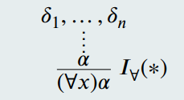

$(*)\quad x$ no ocurre libre en las hipótesis $\delta_1,\ldots,\delta_n$.

#### Regla de eliminación

- Hipótesis: $\delta_1,\ldots,\delta_n$ y $t$ el nombre de un término.
- Tesis: El término $t$ cumple la propiedad $\alpha$.
- Demostración: Probamos $(\forall x)\alpha$ usando $\delta_1,\ldots,\delta_n$.
Luego, vale $\alpha[t/x]$.

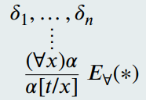

$(*)\quad t$ debe estar libre para $x$ en $\alpha$.

### Reglas para $\exists$

#### Regla de introducción

- Hipótesis: $\delta_1,\ldots,\delta_n$.
- Tesis: Algún individuo cumple la propiedad $\alpha$.
- Demostración: Pruebo que $\alpha$ vale para cierto $t$, usando $\delta_1,\ldots,\delta_n$.
Luego, existe un elemento para el cual vale $\alpha$

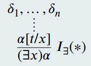

$(*)\quad t$ debe estar libre para $x$ en $\alpha$.

#### Regla de eliminación

- Hipótesis: $\delta_1,\ldots,\delta_n$, algún individuo cumple la propiedad $\alpha$ y $x\notin FV(\{\delta_1,\ldots,\delta_n\})$
- Tesis: Se cumple $\beta$
- Demostración: Asumimos que $x$ cumple $\alpha$, probamos $\beta$ usando $\delta_1,\ldots,\delta_n$ y $\alpha$.
Luego, hemos probado $\beta$, usando $\delta_1,\ldots,\delta_n$ y $(\exists x)\alpha$

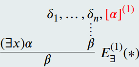

$(*)\quad x$ no ocurre libre ni en $\beta$ ni en las hipótesis $\delta_1,\ldots,\delta_n$.

### Observación importante

Una derivación para esta lógica, ya no es correcta solo si logramos encontrar un árbol en $DER_P$ con la forma indicada. Ahora también tenemos que justificar el porque cada paso con las reglas de cuantificadores es correcto (lo visto con $(*)$). Más adelante veremos ejemplos como para entender como realizar esto correctamente.

### Consecuencia sintáctica

Sea $\Gamma\subseteq FORM$ y $\varphi\in FORM$. Decimos que $\varphi$ es consecuencia sintáctica de $\Gamma$ o que $\varphi$ se deriva de $\Gamma$ sii existe $D\in DER_P$ tal que $C(D)=\varphi$ y $H(D)\subseteq\Gamma$.

Notación:
- $\Gamma\vdash\varphi$ se lee $\varphi$ se deriva de $\Gamma$.
- $\vdash\varphi$ se lee $\varphi$ es teorema.

### Restricciones sobre las variables

Cuando introducimos las reglas de introducción y eliminación de $\forall$ y $\exists$, estas vinieron con varias restricciones sobre variables.

Veamos algunos ejemplos de porque necesitamos estas restricciones:

#### Ejemplo 1

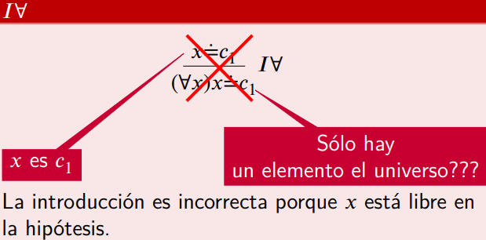

#### Ejemplo 2

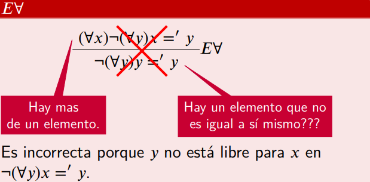

#### Ejemplo 3

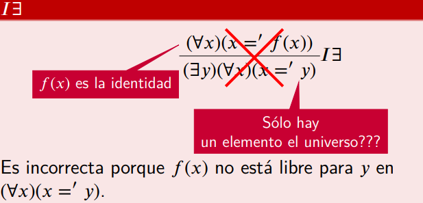

#### Ejemplo 4

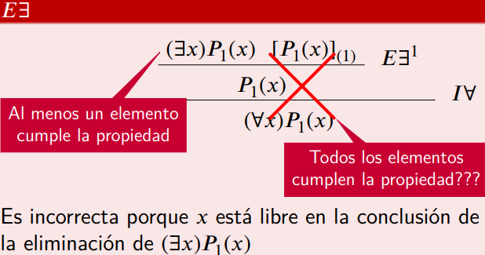

### Restricciones y alcance

- Hay que recordar que las hipótesis canceladas, en realidad, son hipótesis normales de subderivaciones.
- Son hipótesis normales (abiertas, sin cancelar) desde donde aparecen hasta la regla que las cancela y por lo tanto, valen las restricciones en todos las reglas que se utilicen entre esos lugares.

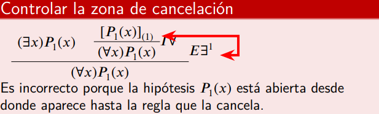

### Derivaciones de ejemplo

#### Ejemplo 1

Veamos que $\vdash(\forall x_1)(\forall x_2)\alpha\to(\forall x_2)(\forall x_1)\alpha$

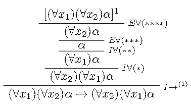

Este es el primer paso. Ahora tenemos que demostrar que cada aplicación de las reglas de cuantificadores, está bien aplicado. Veámoslo:

- $(*) I\forall$: La regla está bien aplicada porque $x_2$ está libre en las hipótesis abiertas a este punto:
    - $(\forall x_1)(\forall x_2)\alpha$
- $(**) I\forall$: La regla está bien aplicada porque $x_1$ está libre en las hipótesis abiertas a este punto:
    - $(\forall x_1)(\forall x_2)\alpha$
- $(***) E\forall$: La regla está bien aplicada porque $x_2$ está libre para $x_2$ en $\alpha$.
- $(****) E\forall$: La regla está bien aplicada porque $x_1$ está libre para $x_1$ en $\alpha$.

Con esto, la derivación es válida.

#### Ejemplo 2

Veamos que $\vdash (\exists x_1)(\exists x_2)\alpha\to(\exists x_2)(\exists x_1)\alpha$

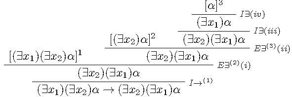

- $(i)E\exists$ Es correcto porque:
    - $x_1\notin FV(C(D))$ que es lo mismo que decir que $x_1$ no está libre en la conclusión
    - $x_1\notin FV(H(D))$ porque no hay hipótesis abiertas en este punto.
- $(ii)E\exists$ Es correcto porque:
    - $x_2\notin FV(C(D))$
    - $x_2\notin FV(H(D))$ porque no hay hipótesis abiertas en este punto.
- $(iii)I\exists$ Es correcto porque $x_2$ está libre para $x_2$ en $(\exists x_1)\alpha$
- $(iv)I\exists$ Es correcto porque $x_1$ está libre para $x_1$ en $\alpha$