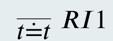
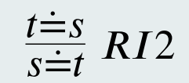
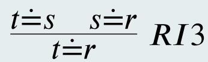
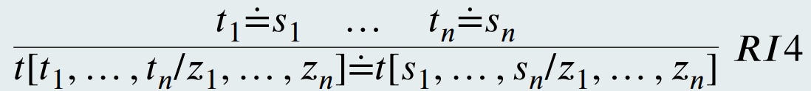
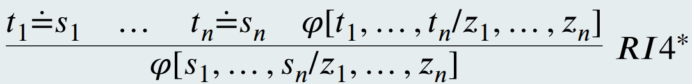
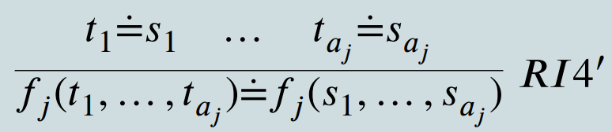
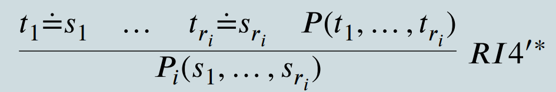

# CLASE 19 - 09/07/2025

## Deducción natural para lógica de predicados

### Propiedades de los cuantificadores

#### Lema: propiedades de derivabilidad de $\forall$

- Si $\Gamma\vdash\varphi$ y $x\notin FV(\Gamma)$ entonces $\Gamma\vdash(\forall x)\varphi$.
- Si $\Gamma\vdash(\forall x)\varphi$ y $t$ libre para $x$ en $\varphi$, entonces $\Gamma\vdash\varphi[t/x]$

#### Lema: propiedades de derivabilidad de $\exists$

- Si $t$ es libre para $x$ en $\varphi$ entonces $\varphi[t/x]\vdash(\exists x)\varphi$
- Si $x\notin FV(\psi)\cup FV(\Gamma)$ entonces, si $\{\Gamma,\varphi\}\vdash\psi$ luego $\{\Gamma,(\exists x)\varphi\}\vdash\psi$

### Igualdad e identidad

Hasta ahora hemos interpretado el símbolo $='$ en cada estructura como la igualdad. Otra alternativa es caracterizarlo como identidad a través de axiomas.

#### Esquemas de axiomas

1. $I1:(\forall x)x='x$
2. $I2:(\forall x)(\forall y)x='y\to y='x$
3. $I3:(\forall x)(\forall y)(\forall z)(x='y\land y='z\to x='z)$
4. $I4:(\forall y_1)\ldots(\forall y_n)(\forall z_1)\ldots(\forall z_n)\left(\bigwedge_{i=1,\ldots, n}y_i='z_i\right)\to t(y_1,\ldots,y_n)='t(z_1,\ldots,z_n)$
    $(\forall y_1)\ldots(\forall y_n)(\forall z_1)\ldots(\forall z_n)\left(\bigwedge_{i=1,\ldots, n}y_i='z_i\right)\to \varphi(y_1,\ldots,y_n)\leftrightarrow \varphi(z_1,\ldots,z_n)$

Donde la última noción es la noción que tenemos de sustituir cosas equivalentes entre si, en términos primero, y luego en fórmulas.

#### Propiedades de los axiomas

- Si una estructura $\mathcal{M}$ es modelo de $I1,I2,I3$ entonces el símbolo $='$ es interpretado por una relación de equivalencia.
- $I4$ exige además que la relación sea una congruencia con respecto a todas las relaciones definibles en el lenguaje.
- Si interpretamos a $='$ como la identidad, se demuestra que toda estructura $\mathcal{M}$ cumple:
    - $\mathcal{M}\models\{I_1,I_2,I_3,I_4\}$

#### Identidad y deducción natural

Los axiomas pueden incorporarse como reglas de derivación:

##### Axioma $I1$

##### Axioma $I2$

##### Axioma $I3$

##### Axioma $I4$

Para términos:

Para fórmulas:

$(*)$ Para cada $i=1,\ldots,n$ se tiene que $t_i$ y $s_i$ están libres para $z_i$ en $\varphi$

##### Otras versiones de las reglas

Sea $\mathcal{L}$ un lenguaje de tipo $\left<r_1,\ldots,r_n;a_1,\ldots,a_m;k \right>$. Entonces los axiomas $RI4$ pueden derivarse de:

