# CLASE 8 - 27/03/2025

## Deducción natural

### Introducción

Tenemos dos formas de trabajar para justificar la válidez de un razonamiento.

- **Justificación semántica $(\Gamma\models\alpha)$**: probar que la veracidad de las hipótesis implica la veracidad de la conclusión.
- **Justificación sintáctica $(\Gamma\vdash\alpha)$**: demostrar la conclusión a partir de las hipótesis usando pasos claramente definidos y explicitados.

#### Justificación sintáctica

- $(\Gamma\vdash\beta)$:
    - Demostrar la conclusión $\beta$ a partir de las hipótesis de $\Gamma$ usando pasos claramente definidos y explicitados.

- Qué es una demostración?
    - Es una prueba formal.
    - La correción de la demostración depende de su forma y no del significado.
    - Cumple reglas precisas de construcción.

#### Pruebas formales

- Cómo probamos usualmente?
    - Sostenenemos hipótesis iniciales (las podemos dar como dato en todo instante de la prueba).
    - Encadenamos pasos simples de deducción que nos permite llegar a la conclusión.
- Por qué pruebas formales?
    - Porque podemos compilar las pruebas hechas, y asegurar su corrección o detectar errores mediante el análisis de su estructura.

#### Ejemplo

En deducción natural, las demostraciones se formalizan mediante árboles:

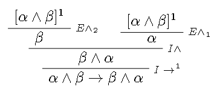{ width=50%}

### Reglas de construcción de pruebas

- Construyen una prueba a partir de subpruebas más simples.
- Manejan correctamente las hipótesis (hipótesis globales) y supuestos (hipótesis locales) en cada etapa de la prueba.

El análisis de corrección de una prueba formal puede mecanizarse, y lo ha sido. Existen asistentes y verificadores automáticos de pruebas para el cálculo proposicional.

En general para cada conectivo se definen:

- **Reglas de introducción**: Indican como probar una fórmula con ese conectivo.
- **Reglas de eliminación**: Indican como utilizar una fórmula con ese conectivo.

#### Reglas de introducción

##### Conjunción ($\land$)

- Hipótesis: $\delta_1,\ldots,\delta_n$.
- Tesis: $\alpha\land\beta$

- Demostración:
    - Probar $\alpha$ usando $\delta_1,\ldots,\delta_n$.
    - Probar $\beta$ usando $\delta_1,\ldots,\delta_n$.
    - Luego, hemos probado $\alpha\land\beta$ usando $\delta_1,\ldots,\delta_n$.

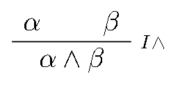{ width=50% }

##### Implica ($\to$)

- Hipótesis: $\delta_1,\ldots,\delta_n, [\alpha]^k$.
- Tesis: $\alpha\to\beta$

- Demostración:
    - Supongamos $\alpha$
    - Probar $\beta$ usando $\delta_1,\ldots,\delta_n$ y $\alpha$
    - Luego, hemos probado $\alpha\to\beta$ usando $\delta_1,\ldots,\delta_n$.

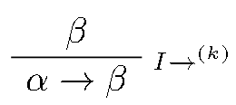{ width=50% }

##### Disyunción ($\lor$)

- Hipótesis: $\delta_1,\ldots,\delta_n$.
- Tesis: $\alpha\lor\beta$

- Demostración:
    - **Opción 1**:
        - Probar $\alpha$ usando $\delta_1,\ldots,\delta_n$
        - Luego, hemos probado $\alpha\lor\beta$ usando $\delta_1,\ldots,\delta_n$.
    - **Opción 2**:
        - Probar $\beta$ usando $\delta_1,\ldots,\delta_n$
        - Luego, hemos probado $\alpha\lor\beta$ usando $\delta_1,\ldots,\delta_n$.

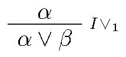{ width=50% }
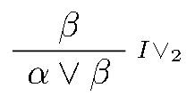{ width=50% }

##### Si y sólo si ($\leftrightarrow$)
- Hipótesis: $\delta_1,\ldots,\delta_n$.
- Tesis: $\alpha\leftrightarrow\beta$
- Demostración:
    - Directo: Supongamos $\alpha$ y probamos $\beta$ usando $\delta_1,\ldots,\delta_n, [\alpha]^k$.
    - Reciproco: Supongamos $\beta$ y probamos $\alpha$ usando $\delta_1,\ldots,\delta_n, [\beta]^k$.
    - Luego, hemos probado que $\alpha\leftrightarrow\beta$ usando $\delta_1,\ldots,\delta_n$.

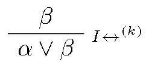{ width=50% }

##### Negación ($\neg$)

- Hipótesis: $\delta_1,\ldots,\delta_n, [\alpha]^k$.
- Tesis: $\neg\alpha$
- Demostración:
    - Supongamos $\alpha$ y probamos una contradicción usando $\delta_1,\ldots,\delta_n, [\alpha]^k$.
    - Luego, hemos probado $\neg\alpha$ usando $\delta_1,\ldots,\delta_n$.

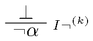{ width=50% }

#### Reglas de eliminación

##### Conjunción ($\land$)

- Hipótesis: $\delta_1,\ldots,\delta_n$.
- Tesis: $\alpha$
- Demostración:
    - Probamos $\alpha\land\beta$ usando $\delta_1,\ldots,\delta_n$.
    - Luego, hemos probado $\alpha$ usando $\delta_1,\ldots,\delta_n$.
    - Simétricamente para $\beta$.

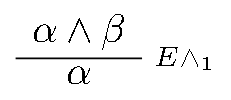{ width=50% }

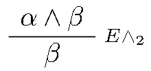{ width=50% }

##### Implica ($\to$)

- Hipótesis: $\delta_1,\ldots,\delta_n$.
- Tesis: $\beta$
- Demostración:
    - Probamos $\alpha\to\beta$ usando $\delta_1,\ldots,\delta_n$.
    - Probamos $\alpha$ usando $\delta_1,\ldots,\delta_n$.
    - Luego, probamos $\beta$ usando $\delta_1,\ldots,\delta_n$.

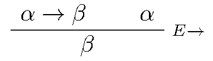{ width=50% }

##### Disyunción ($\lor$)

- Hipótesis: $\delta_1,\ldots,\delta_n, [\alpha]^k$ y $\delta_1,\ldots,\delta_n, [\beta]^k$.
- Tesis: $\delta$
- Demostración:
    - Probamos $\alpha\lor\beta$ usando $\delta_1,\ldots,\delta_n$.
    - Caso A. Probamos $\delta$ usando $\delta_1,\ldots,\delta_n$ y $\alpha$.
    - Caso B. Probamos $\delta$ usando $\delta_1,\ldots,\delta_n$ y $\beta$.
    - Luego, probamos $\delta$ usando $\delta_1,\ldots,\delta_n$

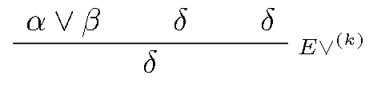{ width=50%}

##### Si y sólo si ($\leftrightarrow$)

- Hipótesis: $\delta_1,\ldots,\delta_n$
- Tesis: $\beta$
- Demostración:
    - Probamos $\alpha\leftrightarrow\beta$ usando $\delta_1,\ldots,\delta_n$.
    - Probamos $\alpha$ usando $\delta_1,\ldots,\delta_n$.
    - Luego, probamos $\beta$ usando $\delta_1,\ldots,\delta_n$.
    - Simétricamente para $\alpha$.

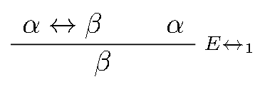{ width=50% }
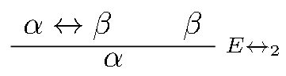{ width=50% }

##### Negación ($\neg$)

- Hipótesis: $\delta_1,\ldots,\delta_n$.
- Tesis: Absurdo.
- Demostración:
    - Probamos $\neg\alpha$ usando $\delta_1,\ldots,\delta_n$.
    - Probamos $\alpha$ usando $\delta_1,\ldots,\delta_n$.
    - Luego, hemos probado $\bot$ usando $\delta_1,\ldots,\delta_n$.

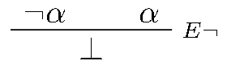{ width=50% }

##### Absurdo ($\bot$)

- Hipótesis: $\delta_1,\ldots,\delta_n$.
- Tesis: $\alpha$.
- Demostración (por reducción al absurdo):
    - Supongamos $\neg\alpha$
    - Llegamos a una contradicción usando $\delta_1,\ldots,\delta_n$ y $[\neg\alpha]^k$.
    - Luego, hemos probado $\alpha$ usando $\delta_1,\ldots,\delta_n$.

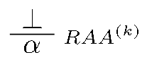{ width=50% }

- Demostración:
    - Llegamos a una contradicción usando $\delta_1,\ldots,\delta_n$.
    - Luego, hemos probado $\alpha$ usando $\delta_1,\ldots,\delta_n$

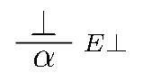{ width=50% }