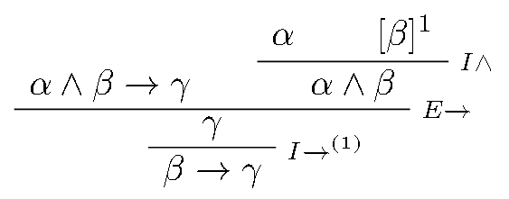

# CLASE 9 - 31/03/2025

## Deducción Natural

### Pruebas = Arboles

- Las derivaciones se definen inductivamente como un conjunto de árboles etiquetados y "bien plantados", o sea con la raíz debajo de las hojas.
- Cada nodo, interno u hoja, se etiqueta con una fórmula proposicional y una regla y si genera hipótesis locales (supuestos), se le pone un superíndice.
- Las hojas son las hipótesis de la prueba.
- La raíz es la conclusión de la prueba.
- De las hojas hacia la raíz se pasa por aplicación de alguna de las reglas de construcción.
- Las hipótesis locales a subpartes de una prueba se representan con hojas tachadas o usando $[\_]^n$ donde $n$ es el superíndice de la regla que la introduce.
- En cada nodo, importa el orden de sus hijos.

#### Ejemplo: $\alpha\land\beta\to\gamma,\alpha\vdash\beta\to\gamma$

### Definición (derivaciones: $DER$)

El conjunto $DER\subseteq\mathcal{T}(\mathcal{E})$ de las derivaciones de la lógica proposicional se define inductivamente como indican las diapositivas correspondientes al tema de deducción natural.

Es literalmente la formalización de las reglas que vimos en la clase anterior, por eso no voy a tomar los apuntes de esta sección.

#### Notación (conclusión e hipótesis)

Sea $D\in DER$. Llamamos $C(D)$ a la conclusión de $D$, y $H(D)$ al conjunto de hipótesis no canceladas de $D$ 

#### Definición (consecuencia sintáctica)

Sean $\Gamma\subseteq PROP$ y $\varphi\in PROP$. Decimos que $\varphi$ es consecuencia sintáctica de $\Gamma$ (o que $\varphi$ se deriva de $\Gamma$) sii existe $D\in DER$ tal que:
- $C(D) = \varphi$
- $H(D)\subseteq\Gamma$

##### Notación

- $\Gamma\vdash\varphi$ se lee "$\varphi$ se deriva de $\Gamma$"
- $\emptyset\vdash\varphi$ se lee "$\varphi$ es teorema" y se escribe $\vdash\varphi$

#### Definición (conjunto de consecuencias sintácticas)

Sea $\Gamma\subseteq PROP$. El conjunto de las consecuencias sintácticas de $\Gamma$ es:
$$CONS(\Gamma) = \{\varphi\in PROP\mid\Gamma\vdash\varphi\}$$